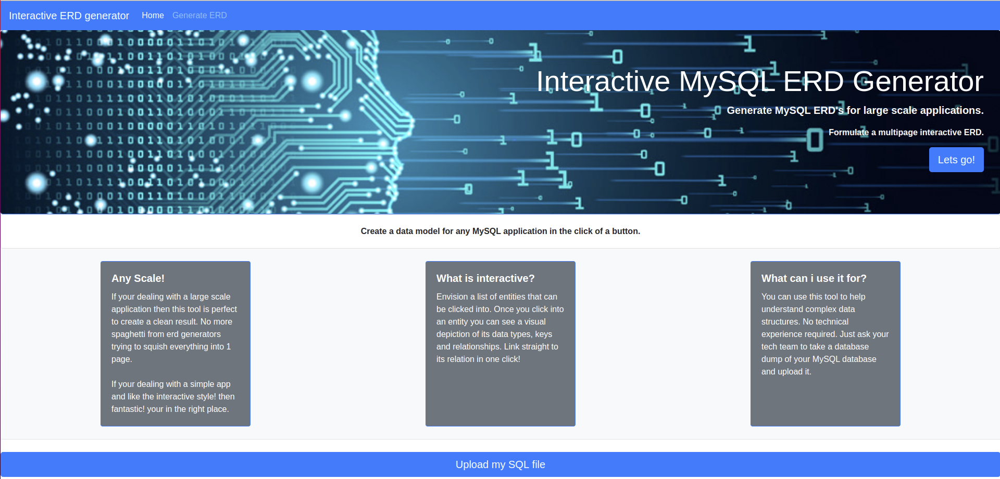

### Interactive ERD

This repo contains a small web APP. It's Basically some ruby logic to extract the entities from an sql file and return a JSON object. This is wrapped with some lightweight Sinatra endpoints to create a small api that serves an interactive pdf representation on an ERD.

The ERD is interactive in the sense that it is paginated and you can click into the different entites to view them. You can then view the data types, keys and relationships of each entity and click through to there relations from within them.

The UI is a basic bootsrap & ERB implementation.

This is just a small prototype of an idea I had.
